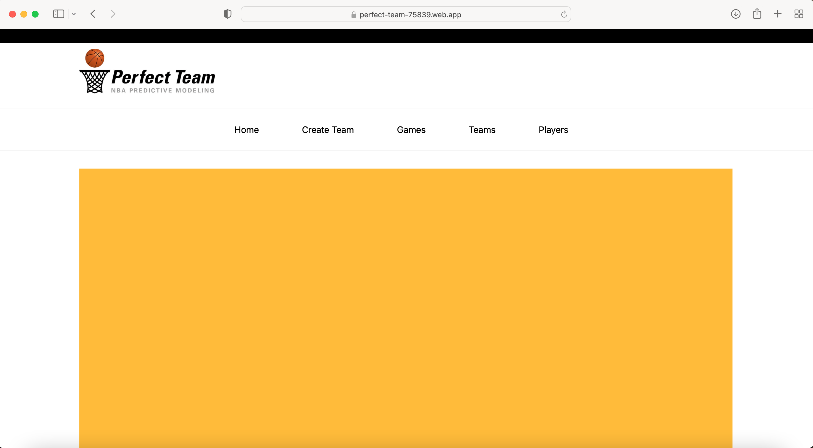
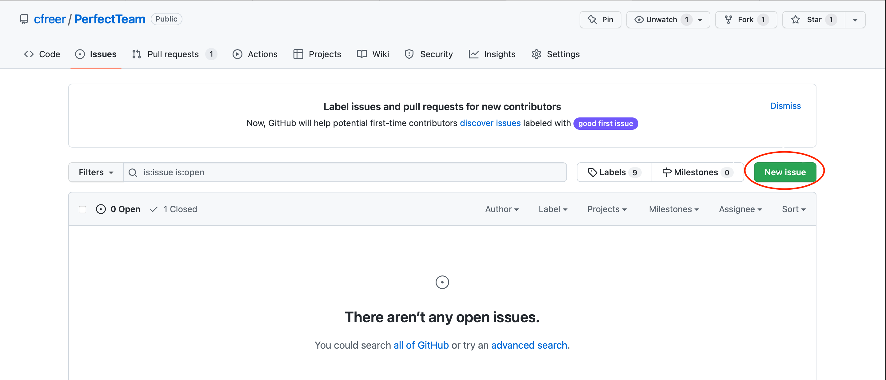

# User Documentation

## High-Level Description
[Click here](https://github.com/cfreer/PerfectTeam#perfectteam) to see our high-level product description, found on our GitHub Repository.

## How to Install the Software
No installation is necessary for our software; it is hosted and can be accessed on https://perfect-team-75839.web.app.

## How to Run the Software
You can run the software by visiting the link: https://perfect-team-75839.web.app.

## How to Use the Software
To create a customized team, navigate to the Create Team page using the “Create Team” tab on the navigation bar or the “Create a Team!” button at the bottom of the home page. Once you are on the Create Team page, type in an NBA player name into the search bar located under the navigation bar. Player name search suggestions will appear under the search bar as you type. Click on the orange “Add Player” button to confirm adding the player you have entered into the search bar. The player’s name and profile picture will appear in the “Current Team” list in the lower half of the page. Please enter 12 NBA players individually into the search bar and add them to the current team. You may also use the “Quick Add NBA Team” button to easily add 12 players from an existing NBA team. Once you click on the button, a popup box will appear on the screen with a dropdown menu. Please use the dropdown menu to select the NBA team you would like the 12 players to be added from. After the current team contains 12 players, a “Create Team!” button and a "Clear Team" button will appear at the bottom of the “Current Team” name list. Click on the "Create Team!" button to get the win prediction and luxury tax amounts in the top-right statistics box. Use the "Clear Team" button to remove all players in the current team. You may also use the "X" button next to a player's name to remove that one player from the team.

The Create Team page loads with the current NBA salary cap set. If you would like to set your own salary cap, click on the edit button next to the salary cap shown in the top-right statistics box. A popup box will appear on the screen, and you may input the new value you would like to set the salary cap. Use the “Save” button to set the salary cap to your entered value.

Receiving player suggestions are currently works in progress.

The Teams page is essentially the simplest page on the web application. You can go to the Teams page from the navigation bar. You will then see a table containing the current NBA teams, their location in the world, and their current season record. This page is purely informational for users unfamiliar with the NBA and would require some additional information to get started and eventually feel comfortable with the app.

The Games page is a little bit more complicated than the Teams page. Again, this page can be accessed by clicking “Games” from the navigation bar. This page is meant to be informational for the user, as it will contain the upcoming games in the NBA, their location, and start time. This page will update along with the current schedule of the games and be an effective tool for users who are curious about the predicted outcomes of upcoming games. This feature is very effective with the “Quick Add NBA Team” feature on the Create Team page, and we recommend users take advantage of this when they wish to see the predictions for upcoming games.

The Players page is the major information hub on the specifics of each player. This page can be accessed from the navigation bar by clicking on the “Players” tab. You will have access to a search bar to search for current players in the NBA. Upon clicking on the “Search Player” button to look for a player, you will see the appropriate matching player’s icon pulled up below the search bar (work in progress). The player’s current team, age, salary, and predicted win/shares will be shown. This page provides valuable information about players. If you would like to search for another player, simply click on the “X” icon in the search bar and input the name of another player.

We are currently working on adding more game-average statistics in the future to give users an even better concept of the players.

## How to Report a Bug
We are using GitHub Issues to keep track of any current and past bugs found in the Perfect Team application. Please follow these steps if you have found a bug and would like to report the bug in GitHub Issues:
1. Make sure that the application you are using is the most up-to-date version.
2. Check to see if you are able to reproduce the bug. If so, please go to the [Issues tab](https://github.com/cfreer/PerfectTeam/issues) in the Perfect Team GitHub repository.
3. Check if any open issues are similar to the bug you may have encountered.
4. If the bug you encountered is already mentioned in an issue, please click on the issue and add a detailed comment if you would like to add more information. Otherwise, click on the “New Issue” button to report the new bug.

5. When creating a new issue, please use a descriptive title and include the page where the bug was found in square brackets. For example, “[Create Team] Players search suggestions not appearing” is a good title for a bug encountered when trying to search for a player on the Create Team page.
6. To describe a bug, please include the following information to the best of your ability:
    - A summary of the bug in one sentence.
    - The results you expected and the results you actually observed.
    - The steps you took to reproduce the bug.
    - Whether the bug occurs consistently or occasionally on a specific action.
    - The webpage of the application where the bug occurred.
    - Whether you encountered the bug as a developer or user.
    - The operating system and browser you used when using the application.

## Known Bugs
All known bugs can be found on the [GitHub Issues page](https://github.com/cfreer/PerfectTeam/issues) in the PerfectTeam GitHub repository.
